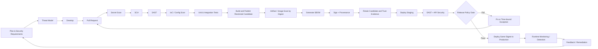
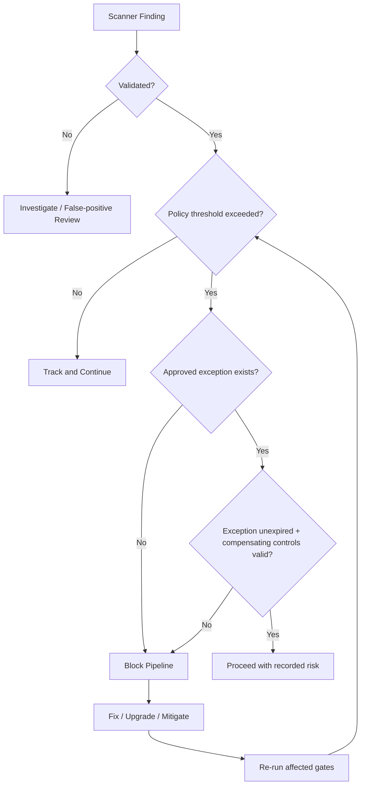

# DevSecOps Security Gates & Production CI/CD Pipeline

[](LICENSE)
[](docs/01-devsecops-overview.md)
[](SECURITY.md)

A production-oriented **DevSecOps reference repository** showing how security controls can be embedded across the software delivery lifecycle—from requirements and threat modeling to source control, CI, artifact supply chain, staged security testing, production release, and runtime monitoring.

> This repository is a reference architecture, not a universal compliance mandate. Organizations should tune gates to application criticality, threat model, regulatory obligations, risk appetite, exploitability, compensating controls, and operational context.

## What this repository covers

- Secure SDLC and threat modeling
- Source-control and pull-request protections
- Secret scanning
- Software Composition Analysis (SCA)
- Static Application Security Testing (SAST)
- Infrastructure-as-Code (IaC) scanning
- Unit, integration, and security-oriented testing
- Container/image scanning
- Software Bill of Materials (SBOM)
- Artifact signing and provenance
- Artifact repository/registry promotion
- Staging deployment
- Dynamic Application Security Testing (DAST)
- API security testing
- Release policy gates and exception handling
- Production deployment and rollback
- Runtime security, monitoring, and response
- Evidence collection and security metrics

## Reference pipeline



## Security-gate philosophy

A **scanner** answers “what did we find?” A **security gate** answers “may this change progress?” The gate should combine technical findings with policy, exploitability, ownership, and exception rules.

Typical baseline controls:

| Stage | Control | Typical tools | Gate intent |
| --- | --- | --- | --- |
| Commit / PR | Secret scanning | Gitleaks, TruffleHog | Block verified leaked credentials |
| PR / CI | SCA | Trivy, OWASP Dependency-Check, native ecosystem tools | Detect vulnerable dependencies and licenses |
| PR / CI | SAST | Semgrep, SonarQube, CodeQL | Detect insecure code patterns early |
| PR / CI | IaC | Trivy, Checkov, tfsec | Prevent risky cloud/K8s/Terraform configuration |
| Build | Image/artifact scan | Trivy, Grype | Assess the deliverable, not only source files |
| Build | SBOM | Syft, Trivy, CycloneDX tooling | Record software composition |
| Release | Signing/provenance | Cosign/Sigstore, Notation | Verify artifact identity and origin |
| Staging | DAST | OWASP ZAP, Burp Suite Enterprise | Test the running application |
| Deploy | Admission/policy | Kyverno, OPA Gatekeeper | Enforce deployment requirements |
| Runtime | Detection | Falco, Tetragon, SIEM/EDR | Detect suspicious behavior after release |

See [tool-matrix/security-tools.md](tool-matrix/security-tools.md) and [policies/security-gates-policy.md](policies/security-gates-policy.md).

## Repository layout

```text
.
├── presentation/       # PPT and presentation assets
├── docs/               # Full DevSecOps implementation guidance
├── diagrams/           # Mermaid source diagrams
├── pipelines/          # Jenkins, GitHub Actions, GitLab CI, Azure DevOps
├── configs/            # Example scanner/tool configuration
├── policies/           # Security gate and governance policies
├── scripts/            # Reusable local/CI wrappers
├── examples/           # Stack-specific implementation notes
├── tool-matrix/        # Tool selection guidance
├── reports/examples/   # Sanitized example result formats
├── threat-model/       # Threat-model template and example
├── compliance/         # Evidence and control mapping
└── references/         # Glossary and authoritative references
```

## Start here

**New to the project?** Start with the [browser-readable offline handbook](docs/DEVSECOPS_HANDBOOK.html), its [Markdown edition](docs/DEVSECOPS_HANDBOOK.md), and the [expanded glossary](references/glossary.md).

- **Beginner:** follow the presentation and handbook from foundations through the pipeline flow.
- **Intermediate:** use the [detection and data-update matrix](docs/DETECTION_AND_DATA.md) and [runnable quickstart](docs/implementation/quickstart.md).
- **Professional:** review [implementation findings](docs/PROJECT_REVIEW.md), [release acceptance contract](docs/implementation/release-contract.md) and [validation evidence](docs/VALIDATION.md).

**Implementation status:** this is a reference project with scanner wrappers and integration templates, not a deployed application. Provision scanner tools before running templates. DAST and production release verification remain application-specific integrations and deliberately fail until implemented. The local Semgrep rule is a small demonstration. The full boundaries are documented in the project review.

1. Read [docs/00-introduction.md](docs/00-introduction.md).
2. Understand the lifecycle in [docs/02-devsecops-lifecycle.md](docs/02-devsecops-lifecycle.md).
3. Review the reference pipeline in [docs/03-industry-aligned-pipeline.md](docs/03-industry-aligned-pipeline.md).
4. Define gates with [policies/security-gates-policy.md](policies/security-gates-policy.md).
5. Pick tools using [tool-matrix/security-tools.md](tool-matrix/security-tools.md) and [tool-matrix/language-tools.md](tool-matrix/language-tools.md).
6. Start with one CI implementation from [pipelines/](pipelines/README.md).
7. Add threat modeling, SBOM, signing, staging DAST, release evidence, and runtime detection as maturity grows.

## Example release decision



## Stack guidance

This repository includes examples for:

- JavaScript / TypeScript / Node.js
- Java / Kotlin
- Python
- .NET / C#
- Go

The same **control objectives** apply across stacks, but the best scanners and package-audit tools may differ. See [tool-matrix/language-tools.md](tool-matrix/language-tools.md).

## Standards and reference guidance

The architecture is aligned conceptually with:

- **NIST SP 800-218 SSDF v1.1** — secure development practices integrated into an SDLC.
- **OWASP DevSecOps Guideline** — security activities and automation in CI/CD.
- **OWASP ASVS 5.0.0** — verifiable application security requirements.
- **SLSA v1.2** — software supply-chain security, provenance, and increasing assurance.
- **CISA Secure by Design** — building security into product design and development.

See [references/references.md](references/references.md) for official links.

## Important implementation rules

- Never store real credentials, tokens, private keys, `.env` secrets, or production certificates in this repository.
- Run active DAST only against systems you are authorized to test; staging is the normal target.
- Pin third-party CI actions/plugins and container images in production environments.
- Prefer short-lived workload identity/OIDC over long-lived CI secrets when the platform supports it.
- Build once; promote the **same immutable artifact/digest** across environments.
- Keep exceptions documented, approved, owned, and time-bound.
- Preserve scan output, approvals, artifact digests, SBOMs, attestations, and deployment evidence according to your audit/retention policy.

## Presentation

The redesigned course is available as an [editable PowerPoint](presentation/DevSecOps_Industry_Standard_Pipeline.pptx), a [matching PDF](presentation/DevSecOps_Industry_Standard_Pipeline.pdf), and an [offline handbook with full notes](docs/DEVSECOPS_HANDBOOK.md). See the [slide index](presentation/slide-index.md) and [rebuild instructions](presentation/README.md).

The original source presentation is archived under `presentation/source-original/` for traceability.

## License

Apache License 2.0. See [LICENSE](LICENSE).

## Disclaimer

This repository is for defensive security engineering, education, and authorized testing. See [DISCLAIMER.md](DISCLAIMER.md).
